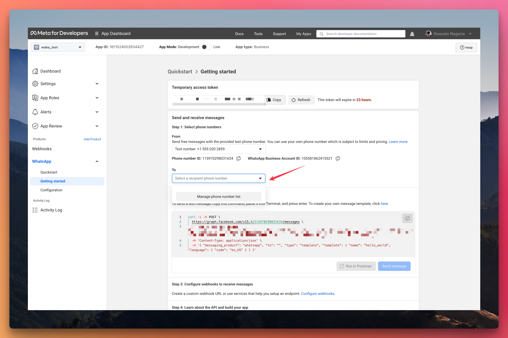
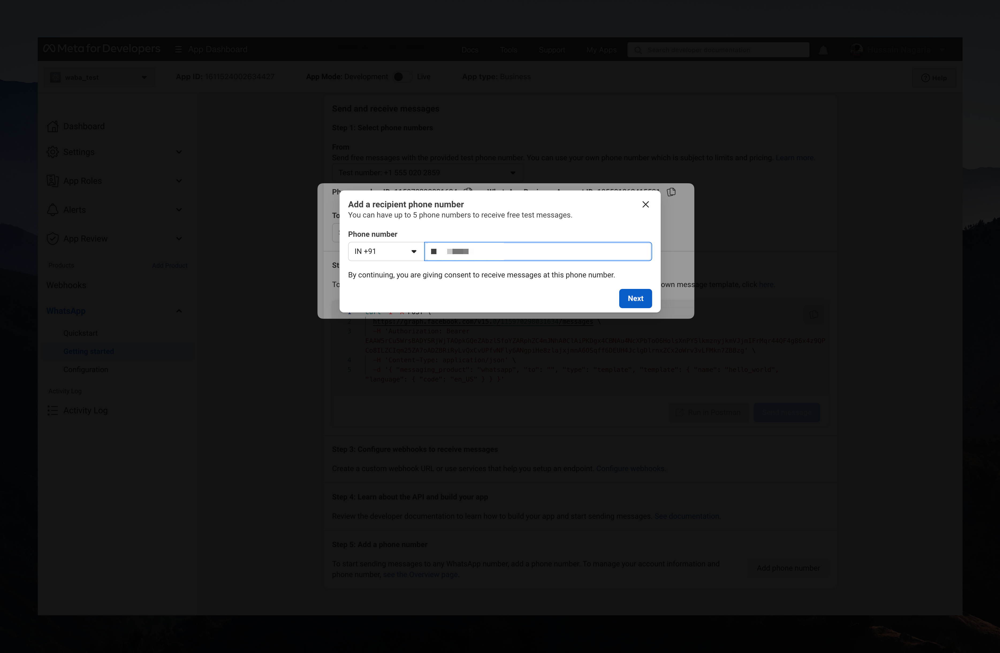
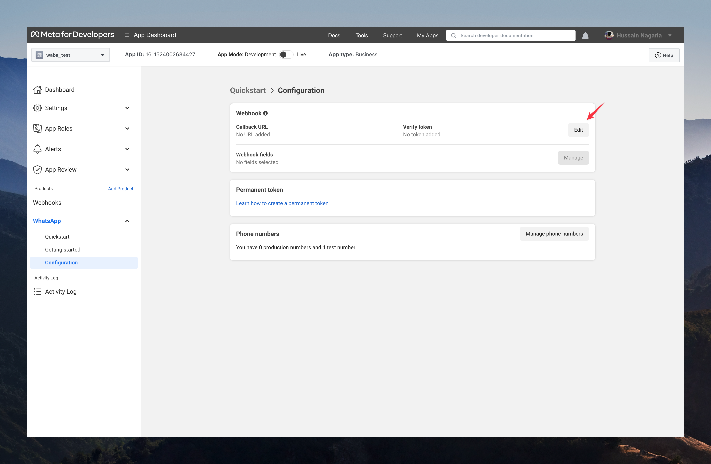

## WhatsApp Business API Integration

Work with WhatsApp Business Cloud API from your Frappe site. Automate sending and releasing of WhatsApp messages.

## Installation

```bash
bench get-app NagariaHussain/waba_integration
bench --site <site-name> install-app waba_integration
```

If you want to install on Frappe Cloud, presently, you can fork and add it to your private bench.

## Getting Started

In order to set up the app, you will need to first setup developer assets and get credentials from the **Meta Developer Portal**. You can do so by following [this guide](https://developers.facebook.com/docs/whatsapp/cloud-api/get-started#set-up-developer-assets).

In developer mode, if you want to send a message to a number, you have to explicitly add it (also verified by an OTP) to the recipient's list:





Now, try sending a test message from the developer dashboard by clicking the `Send Message` button:


If you received the message, you are set!

### Configuring Webhook

Step 1:


Step 2:



Step 3:


The callback URL will be:

```
<your-site-base-url>/api/method/waba_integration.api.webhook.handle
```

For instance:

```
https://hussain.frappe.cloud/api/method/waba_integration.api.webhook.handle
```

You can set the verify token to any random string, but remember it, since we will need it in the next step.

> Note: For working with webhooks in the development environment, you will need to use ngrok to proxy the webhooks to your local.

## Setting up the app

Open `WABA Settings` form and fill in the credentials you obtained in the last step from the Meta developer console:


The **Webhook Verify Token** must be same as the verify token you set in the developer console's webhook configuration in the previous step.

### Permanent Token / Production Setup

The temporary token generated above is only valid for 24 hours and is only suitable for development. In order to generate a permanent token, please refer [this](https://developers.facebook.com/docs/whatsapp/business-management-api/get-started#1--acquire-an-access-token-using-a-system-user-or-facebook-login) guide.

## Sending Your First Message

You can use the **WABA WhatsApp Message** doctype to create and send messaged. Whenever you receive a new message, you will find it here.

## Debugging / Webhook Logs

Use the **WABA Webhook Log** to see all the webhooks received from WhatsApp Cloud API. You can use this for debugging and also you can write hooks on top of it to build your own integrations.

#### License

MIT
